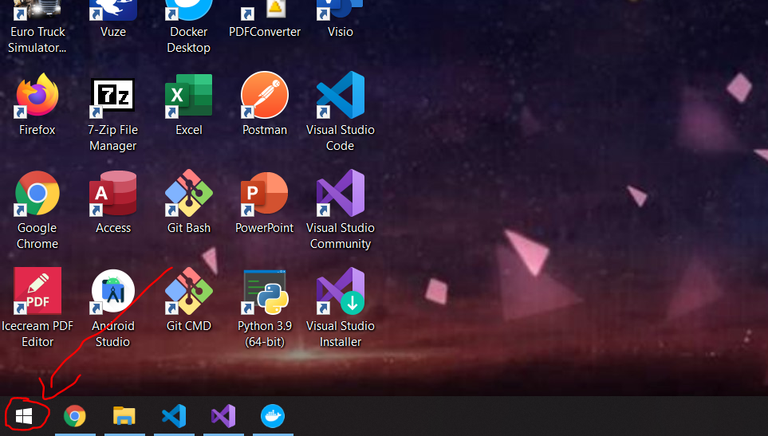
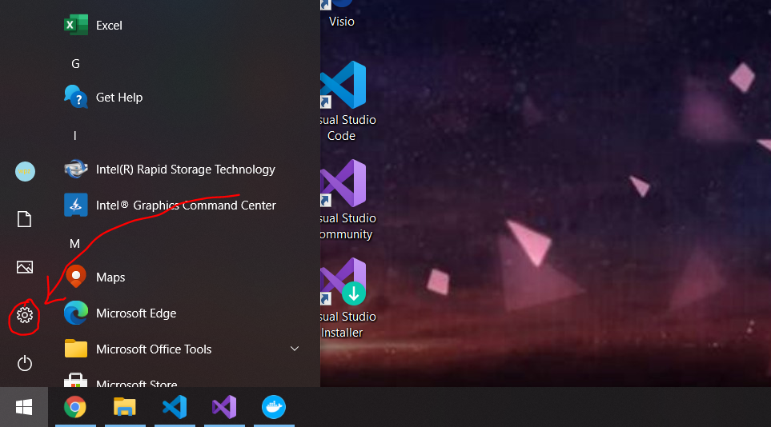
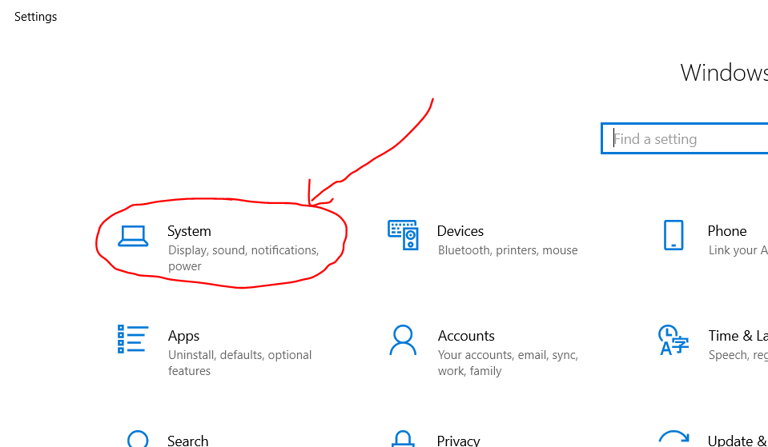
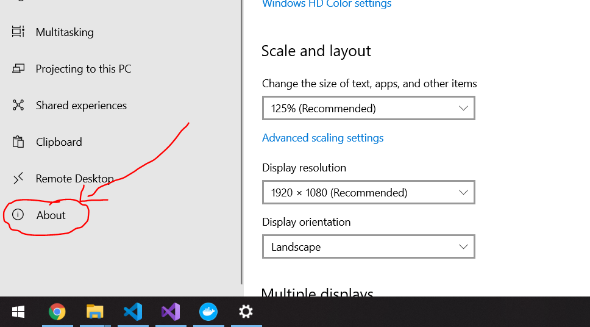
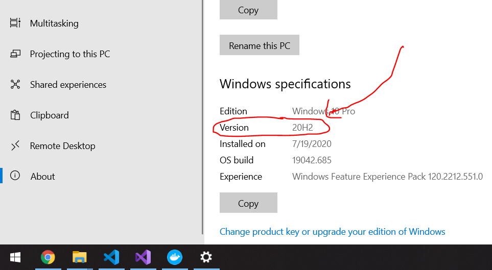
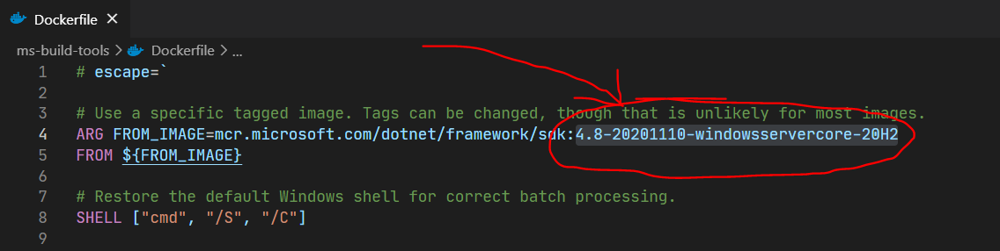

# viewify
It is a GUI framework based on SDL 2 that can help developers create desktop client applications, video games and etc in record time.

## Table of Contents
- [For developers reading this in GitHub](https://gitlab.com/ii887522/viewify#for-developers-reading-this-in-github)
- [Prerequisites](https://gitlab.com/ii887522/viewify#prerequisites)
- [Update .NET Framework SDK version used by ms-build-tools to match your OS](https://gitlab.com/ii887522/viewify#update-net-framework-sdk-version-used-by-ms-build-tools-to-match-your-os)
- [Build custom-node docker image](https://gitlab.com/ii887522/viewify#build-custom-node-docker-image)
- [Build ms-build-tools docker image](https://gitlab.com/ii887522/viewify#build-ms-build-tools-docker-image)
- [Install dependencies](https://gitlab.com/ii887522/viewify#install-dependencies)
- [Build project](https://gitlab.com/ii887522/viewify#build-project)

## For developers reading this in GitHub
Please go to https://gitlab.com/ii887522/viewify to start contributing instead.

## Prerequisites
- [Docker Desktop](https://www.docker.com/products/docker-desktop) using Windows containers
- [Visual Studio Code](https://code.visualstudio.com/)
  - Docker
  - EditorConfig for VS Code
  - Markdown All in One
  - Remote - WSL
- [Visual Studio Community 2019](https://visualstudio.microsoft.com/) and later
  - Extensions:
    - Markdown Editor
    - EditorConfig Language Service
  - Workloads:
    - Desktop development with C++
  - Individual components:
    - JavaScript and TypeScript language support
    - Git for Windows

## Update .NET Framework SDK version used by ms-build-tools to match your OS
1. Left click on the start button at the bottom left corner of your desktop.

  <br /><br />

2. Left click on the settings button at the left side of the start menu.

  <br /><br />

3. Left click on the system button at the top left corner of settings window.

  <br /><br />

4. Left click on the about button at the bottom left corner of settings window.

  <br /><br />

5. Take note of the version shown in the settings window. You will need it to search for appropriate tags later.

  <br /><br />

6. Go to https://hub.docker.com/_/microsoft-dotnet-framework-sdk/ and find Full Tag Listing section.
7. Copy a tag that contains the version you have taken note of under Full Tag Listing section.
8. Finally, inside the repository, navigate to `ms-build-tools/Dockerfile`. Then, paste to replace the tag as highlighted and shown in the screenshot below and save it.

  <br /><br />

## Build custom-node docker image
```sh
cd custom-node
build
cd ..
```

## Build ms-build-tools docker image
```sh
cd ms-build-tools
build
cd ..
```

## Install dependencies
```sh
install
```

### Build project
```sh
build
```

### Deploy project
```sh
deploy <access-token>
```
